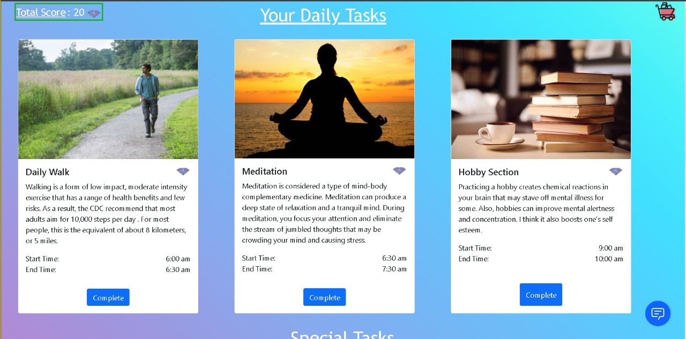

# **DENIHILIFY** 

##  💼 &nbsp; **Tagline :**  From Depression to Deep Rest

 🛠 &nbsp;Tech Stack

&nbsp;
&nbsp;
&nbsp;
&nbsp;
&nbsp;
&nbsp;
&nbsp;
&nbsp;
&nbsp;

##  💼 &nbsp; **Challenges we ran into**

To integrate maximun number of possible questions in chat bot, with all the possibilites a normal human could ask .To integrate Tone analyzer with Watson Assistant was the most challenging task.

## 🔭 &nbsp; About this Project

>The silent killer that takes lives without warning, punishment, or any sympathy; depression is truly one of the most prominent mental illnesses in the world. Depression is defined as a mental illness inducing a severe and staunch feeling of sadness. The term depressed is coined in English as a temporary sadness that everyone experiences in their life. The suicidal well of depression has swallowed many, and this well is growing deeper and wider with time. 

>>Studies have shown that youngsters are more prone to fall in this trap, so being need of the hour it is vital to work upon this issue.Keeping an eye on these issues , project Denihilify
is a proposal by our team  Dream Makers to heal people suffering from anxiety and lend a helping hand to people suffering from depression. Mental illness symptoms must be identified as early as possible as untreated symptoms continue and worsen over time. Globally, over a million people commit suicide every year. Approximately 2% of all worldwide deaths and suicides are because of depression. In India the ratio is even threatening.

## 🔭 &nbsp; Description of the Project

_``Our Project is a combination of Chatbot and Website.``_

💼 &nbsp; **Website**

>Our project is an initiative to raise awareness about mental health and lend a helping hand towards those who are going through rough times. The basic idea is to develop a space(platform) where one can talk openly about problems he/she is facing without revealing his/her identity. Moreover, we approach to help them in the long term by using our website to reschedule their life, so that they steadily overcome this stage of life.

>>The best way to cure depression, Melancholy, anxiety is to uplift the confidence and make their life colorful again. Based on this design principle our team has designed a dynamic webpage for people who need help in this rough patch of their life. 

1) **Home**:Homepage of website has been designed keeping in mind that the person might be low at the moment, so to cheer him up a soft theme is presented. It is easy enough for beginner to get started with homepage. 

>When you will click on **Get Started** you will be directed to our Sign up/Login Page.

2) **Daily Task**:To start on a early and easy phase we have designed best suited schedule for the user. Following this schedule step wise will bring out the best change in you for your better.The user need to update the site after completing each task and is rewarded accordingly.

>3) **Special Task**:Our site also includes a set of specially designed tasks that our given to an individual on daily basis. The tasks are not only meant to destress the individual but also the streak based format makes them more lively and fun to do.

4) **Store**:After earning points from their daily streaks and special activities, they can make the most of their rewards by buying exciting stuff from our store of items.

5) **Chatbot**:Now comes the heart of our webpage that is Chatbot named ***Raghav***. Your friend that stands with you in all situations and uplift your mood and revive your broken confidence.Our IBM Watson lite bot designed using AI will help people to analyze their depression and on the other hand web application will help to cure their problem giving them a proper routine.

 

>Click on the 
[Link](https://drive.google.com/file/d/1CXnzpZCOaGdLIogPopiNcQ4GtadVNMoc/view?usp=sharing)
to check the demo of the Chatbot

6) **Team**:

----
<!-- CONTRIBUTING -->

## Contributing

Contributions are what make the open source community such an amazing place to be learn, inspire, and create. Any contributions you make are **greatly appreciated**.

1. Fork the Project
2. Create your Feature Branch (`git checkout -b feature/AmazingFeature`)
3. Commit your Changes (`git commit -m 'Add some AmazingFeature'`)
4. Push to the Branch (`git push origin feature/AmazingFeature`)
5. Open a Pull Request
----
<!-- LICENSE -->
##   

Distributed under the MIT License. See `LICENSE` for more information.

